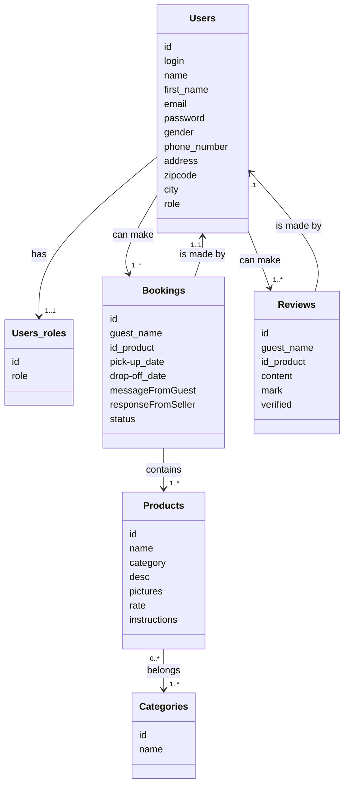
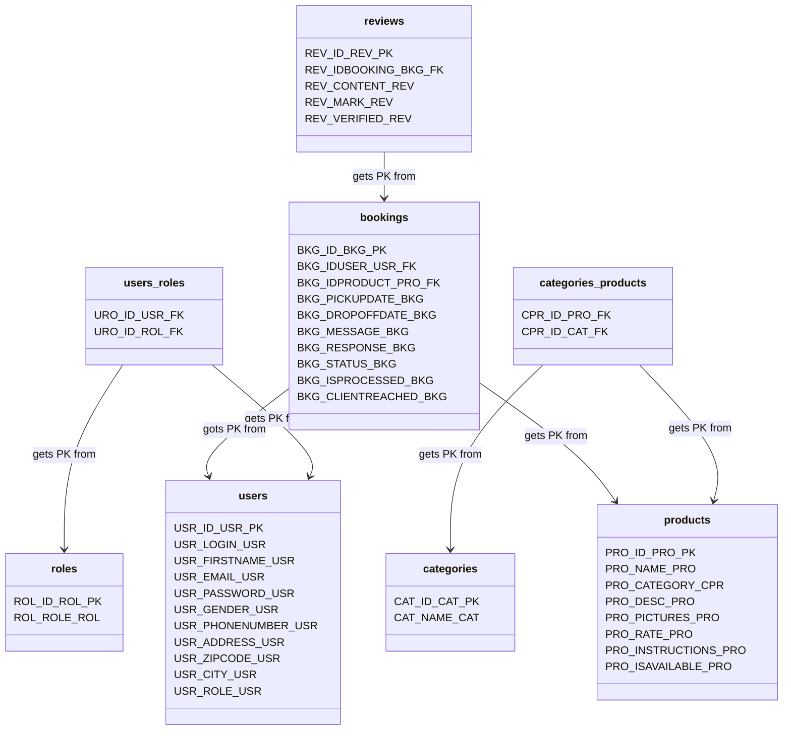
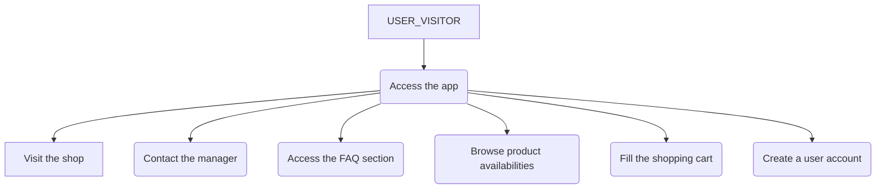
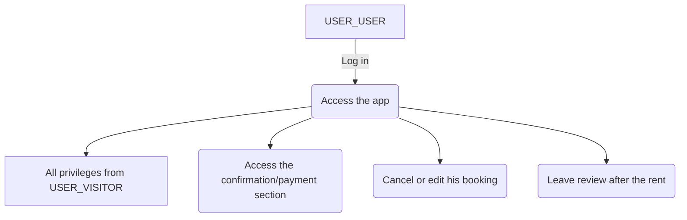
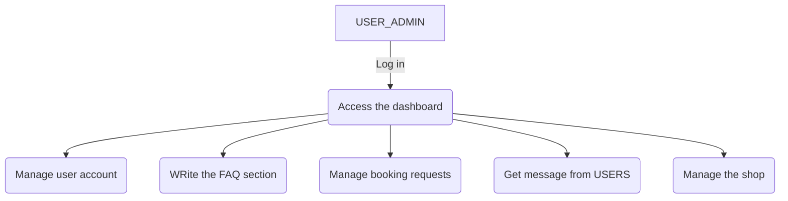

# HomeSono

## [Training roadmap](https://gitlab.com/ofp-oc-cda2/ressources/-/blob/main/Formation/Programme.md)
## [Directive](https://gitlab.com/ofp-oc-cda2/ressources/-/blob/main/Formation/Fil%20rouge.md#livrables)
#

# Summary

 - [First brainstorm](#first-brainstorm)
 - [Diagrams](#diagrams)
    - [MCD](#mcd)
    -  [MLD](#mld)
    - [Flow Chart](#flow-chart)
# 

 # First brainstorm
- [My project on Notion, easier to read and edit](https://nicolasmaesfr.notion.site/HomeSono-32fc326f03b54eed987b3ba9d79fd54c)
- [the markdown on GitLab](markdown_files/design_first_brainstorm.md)
#

# Diagrams
# MCD

# 

# MLD

#

# Flow Chart

#

# Other diagrams