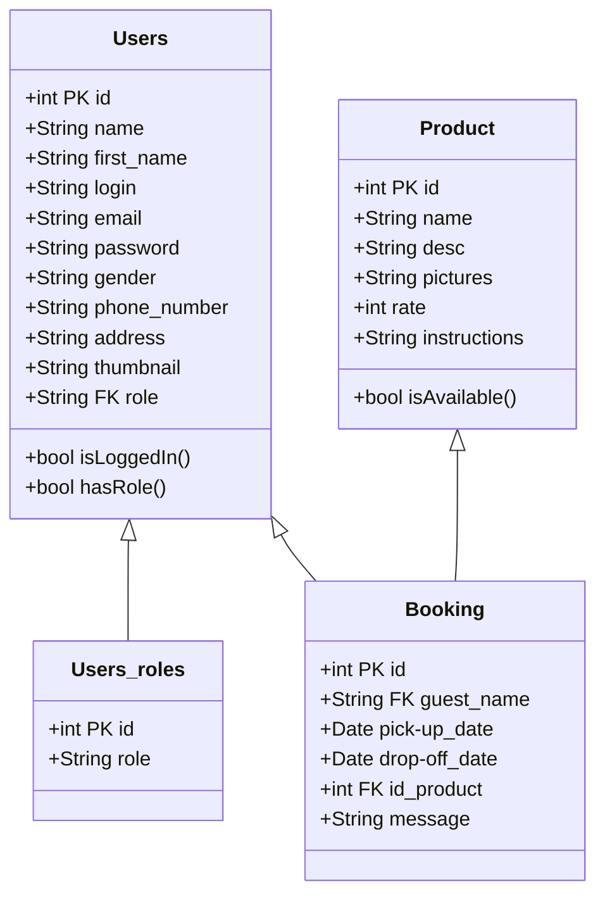

```mermaid
classDiagram

    Users <|-- Users_roles
    Product <|-- Booking
    Users <|-- Booking

    class Users{
      +int PK id
      +String name
      +String first_name
      +String login
      +String email
      +String password
      +String gender
      +String phone_number
      +String address
      +String thumbnail
      +String FK role
      +bool isLoggedIn()
      +bool hasRole()
    }
    class Product{
        +int PK id
        +String name
        +String desc
        +String pictures
        +int rate
        +String instructions
        +bool isAvailable()
        }
    class Users_roles{
        +int PK id
        +String role
    }
    class Booking{
        +int PK id
        +String FK guest_name
        +Date pick-up_date
        +Date drop-off_date
        +int FK id_product
        +String message
    }
```