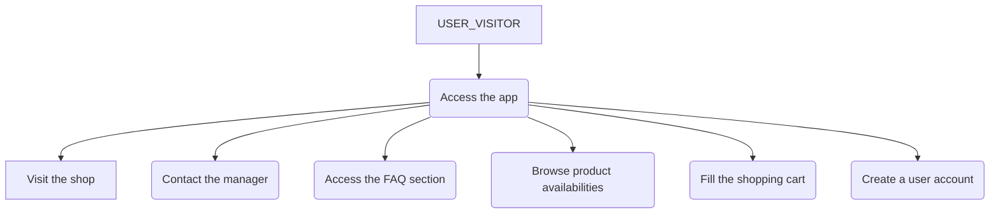
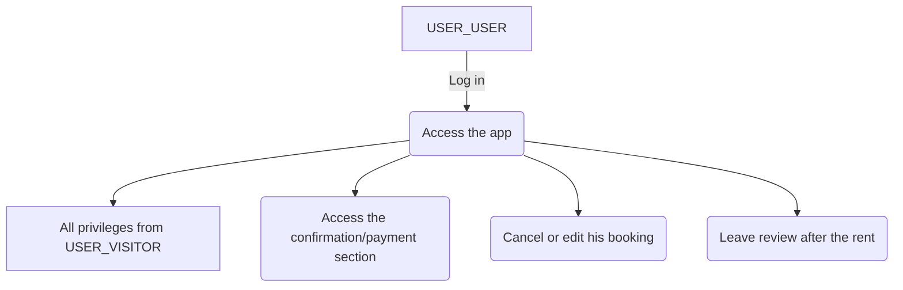
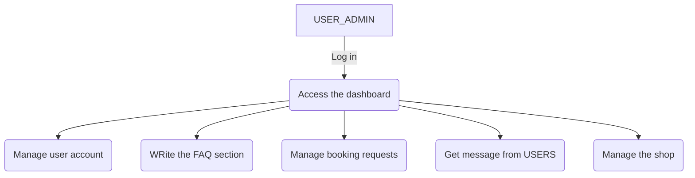

```mermaid
graph TD
    A[USER_VISITOR] --> B(Access the app)
    B --> C[Visit the shop]
    B --> D(Contact the manager)
    B --> E(Access the FAQ section)
    B --> F(Browse product availabilities)
    B --> G(Fill the shopping cart)
    B --> H(Create a user account)
```

```mermaid
graph TD
    A[USER_USER] --> |Log in|B(Access the app)
    B --> C[All privileges from USER_VISITOR]
    B--> M(Access the confirmation/payment section)
    B--> N(Cancel or edit his booking)
    B--> O(Leave review after the rent)
```

```mermaid
graph TD
A[USER_ADMIN]-->|Log in| B(Access the dashboard)
    B--> C(Manage user account)
    B--> D(WRite the FAQ section)
    B--> E(Manage booking requests)
    B--> F(Get message from USERS)
    B--> G(Manage the shop)
```