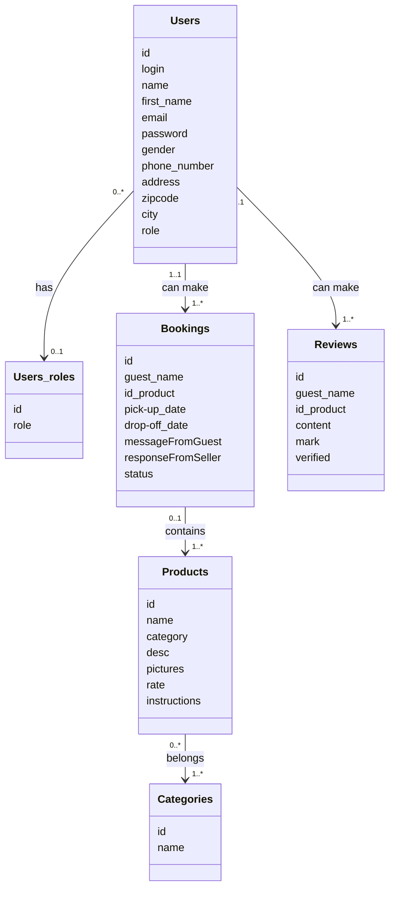

# MCD

```mermaid
classDiagram

    Users "0..*" -->  "0..1" Users_roles : has
    Bookings "0..1"--> "1..*" Products : contains
    Users  "1..1" --> "1..*" Bookings : can make
    Users  "1..1" --> "1..*" Reviews : can make
    Products "0..*" -->  "1..*" Categories : belongs

    class Users{
        id
        login
        name
        first_name
        email
        password
        gender
        phone_number
        address
        zipcode
        city
        role
    }
    class Products{
        id
        name
        category
        desc
        pictures
        rate
        instructions
        }
    class Categories{
        id
        name
        }
    class Users_roles{
        id
        role
    }
    class Bookings{
        id
        guest_name
        id_product
        pick-up_date
        drop-off_date
        messageFromGuest
        responseFromSeller
        status
    }
    class Reviews{
        id
        guest_name
        id_product
        content
        mark
        verified
    }
```