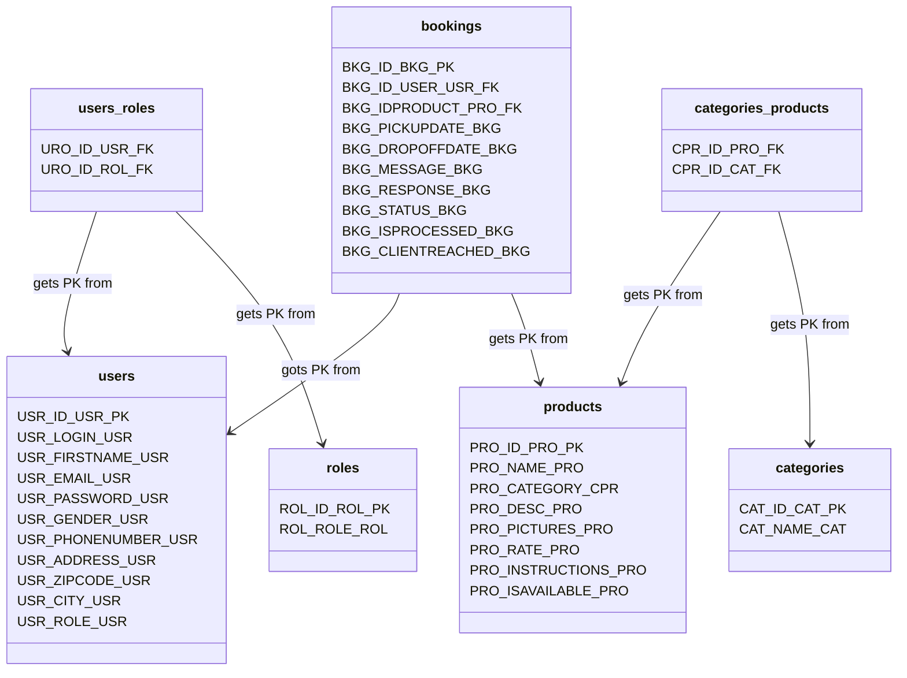

```mermaid
classDiagram

        users_roles  --> users : gets PK from
        users_roles  --> roles : gets PK from
        categories_products  --> products : gets PK from
        categories_products  --> categories : gets PK from
        bookings  --> users : gots PK from
        bookings  --> products : gets PK from


    class users{
        USR_ID_USR_PK
        USR_LOGIN_USR
        USR_FIRSTNAME_USR
        USR_EMAIL_USR
        USR_PASSWORD_USR
        USR_GENDER_USR
        USR_PHONENUMBER_USR
        USR_ADDRESS_USR
        USR_ZIPCODE_USR
        USR_CITY_USR
        USR_ROLE_USR
    }
    class roles{
        ROL_ID_ROL_PK
        ROL_ROLE_ROL
    }
    class users_roles{
        URO_ID_USR_FK
        URO_ID_ROL_FK
    }
    class products{
        PRO_ID_PRO_PK
        PRO_NAME_PRO
        PRO_CATEGORY_CPR
        PRO_DESC_PRO
        PRO_PICTURES_PRO
        PRO_RATE_PRO
        PRO_INSTRUCTIONS_PRO
        PRO_ISAVAILABLE_PRO
        }
    class categories{
        CAT_ID_CAT_PK
        CAT_NAME_CAT
        }
    class categories_products{
        CPR_ID_PRO_FK
        CPR_ID_CAT_FK
        }

    class bookings{
        BKG_ID_BKG_PK
        BKG_ID_USER_USR_FK
        BKG_IDPRODUCT_PRO_FK
        BKG_PICKUPDATE_BKG
        BKG_DROPOFFDATE_BKG
        BKG_MESSAGE_BKG
        BKG_RESPONSE_BKG
        BKG_STATUS_BKG
        BKG_ISPROCESSED_BKG
        BKG_CLIENTREACHED_BKG
    }
```